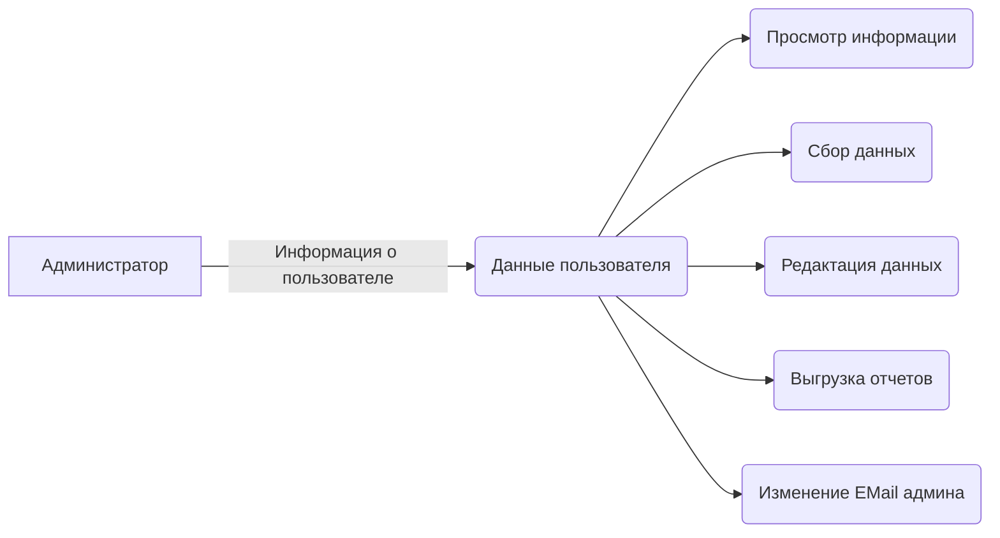
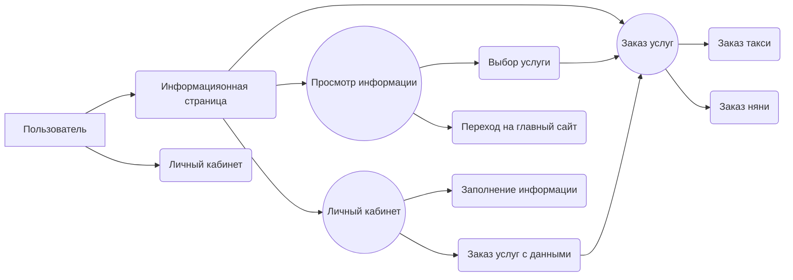

# Добро пожаловать в проект "Город для всех"

Это руководство будет использоваться в первую очередь для дальнейшей разработки, отчетов и общего понимания сотрудников.
Написание производилось группой студентов **"Московского Политеха".**

 - **Репозиторий проекта:** [City For All](https://github.com/akruzhalov/city_for_all)
 - **Временный сервер проекта:** [Server CFA]([https://cfa-spa.web.app/](https://cfa-spa.web.app/))
 - **Информация о разработчиках:** [Разработчики](https://docs.google.com/spreadsheets/d/1YrW61N9GrMDLYFTE_CLDXZeZbGR6OJpD5PZK4f6vaUA/edit#gid=0)

# Описание проекта

На данный момент проект находится в **beta-версии.**
Проект содержит в себе следующие сущности
 - **Информационная страница** - *Главные пользовательские экраны, информация об услугах, ссылки на главный источник.*
 - **Личный кабинет пользователя** - *Опции входа и выхода, все данные содержатся в БД клиентов, опции заказа услуг прямо из личного кабинета, с указанными ранее данными, связь с сотрудниками администрации.*
 - **Админ-панель** - *Главный инструмент администратора, содержит в себе данные о всех клиентах, их данных и заказах*

## Возможности приложения

 1. *Пользователи* могут ознакомится с текущей версией приложения.
 2. *Пользователи* могут зарегистрироваться в приложении, посмотреть график возможных заказов, заполнить свой личный кабинет.
 3. *Пользователи* могут заказать услугу.
 4. *Пользователь* может перейти по ознакомительным ссылкам на сайт региона.

## Структура приложения и используемые технологии

Приложение состоит из:

 - **Визуальной части**
 - **Логической части**

На визуальной части написана вся внешняя структура приложения.
### В визуальной части используются следующие языки высшего уровня:

 - HTML
 - CSS (ScSS)
 - JS (React)
 - Node.JS (Npm библиотеки)

Так, как мы пользуемся технологией **React Framework**, то все наше приложение строится на *"Коробочной"* React структуре, под руководством *Node.JS*.
Соответственно, мы для написания приложения мы используем так называемый **JSX** код, который подразумевает под собой слияние **HTML и JS Vanilla**. *(Подробнее - [React.JS]([https://ru.reactjs.org/](https://ru.reactjs.org/)))*.
Структура написана с помощью различных библиотек и *"чистого"* кода, на основе **FlexBox**.

**Так же мы пользуемся дополнительными библиотеками, такими как:**

 - React Bootstrap
 - Rauventa UI components *(Разработка студента 2 курса - [Моисеенко Ильи](http://rauventa.ru))*
 - Material UI
 - Npm Библиотеки *(Такие, как validator, data-picker, time-data и т.д.)*

### В логической части используются следующие технологии:

 - Node.Js
 - FireBase
 - PhP

В основе логики проекта лежит **NoSQL** облачная БД - **Firebase**. Некоторые корректировочные запросы написаны на **Node.JS**.
Логика оправки запросов на почту организована с помощью языка **PhP**.

Чтобы работать со структурой приложения изнутри, нужна углубиться в логику **FireBase**, ознакомиться с этим сервисом вы можете тут - [FireBase Docs](https://firebase.google.com).
Структура запросов представлять собой JSON формат, обращение к объектам с помощью *API* самой **FireBase**.

**Прошу обратить внимание на JSON структурy в FireBase:**


У нас используется объект, который хранит в себе **ID LocalStrorage** пользователя.
Внутри него хранится **ID FireBase**.
После чего у нас идут **все данные пользователя**, указанные в профиле, и **объект заказов пользователя**. 

> Также **подробная структура** описана в ветках на [GitHub]([https://github.com/akruzhalov/city_for_all](https://github.com/akruzhalov/city_for_all)) проекта.

**Внимание!** *Проведите debug-сессию перед переходом на новую БД, или ее смену. Спасибо!*

> **Обратите внимание**, что по окончании весеннего семестра 19/20 права на доступ к БД и к временному хостингу будут закрыты.
> *Просьба перенести данные по описанным выше параметрам на другую структуру.*

# Работа с приложением

Для того, чтобы работать с проектом вам нужна рабочая среда (IDE) - **Webstorm/VSCode**.

## Запуск приложения

 1. Для запуска приложения, откройте папку с проектом в вашей IDE.
 2. Откройте терминал.
 3. Напишите следующие команды в строгом порядке!

> **Убедитесь в том. что у вас установлена Node.JS локально!**

```sh
$ cd ../ (Выбрать папку с проектом)
$ npm install 
$ npm run start
```

## Сборка приложения и выгрузка на хостинг

> **Внимание!** Раздел для опытных пользователей!

**Для загрузки приложения на хостинг**, вы должны выполнить следующие действия:

 1. Все так же, открыть приложение в вашей IDE
 2. **Отключить работу приложения командой CTRL + C**
 3. После чего выполнять ряд команд

```sh
$ npm run build
$ -- select build --
$ firebase init (Установить перед этим npm-пакет firebase-cli)
$ firebase login
$ firebase delpoy
```
> В качестве **build** версии выбирать **папку build** в корне приложения.
> Основным файлом является **index.html и index.js**

# Функции пользователя и администратора

Функции будут представлены в виде **UML-диаграмм**.

## Логика администратора



## Логика пользователя


